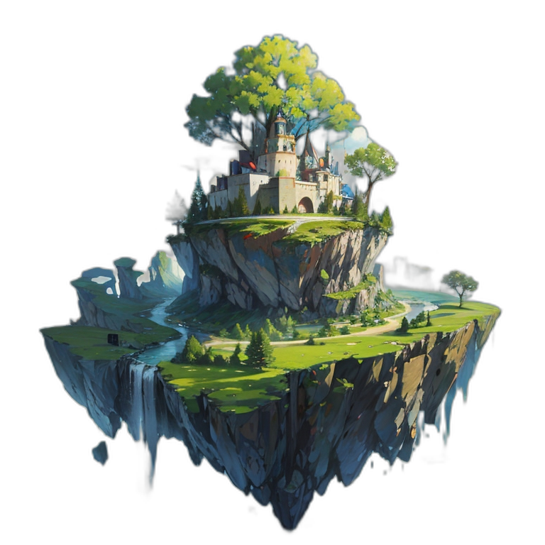

# Magician's Cauldron

  

## Popis

Tato mobilní hra byla vyvinuta jako součást mé **maturitní práce**. Hra je vytvořena v **Unity** a je určena pro platformu **Android** . Cílem hry je vytvářet zbroj pro svého kouzelníka se kterým se snažíte čistit tématické ostrovy od nebezpečných entit.

## Funkce

- **Intuitivní ovládání**: Snadné a přívětivé ovládání pro všechny hráče.
- **Různorodé úrovně**: 30 unikátních úrovní s postupně se zvyšující obtížností.
- **Ukládání pokroku hráče**: Automatické ukládání a načítání herního pokroku.
- **Získávání úrovní**: Možnost odemykání nových úrovní postupným dokončováním herního obsahu.
- **Vybavení hráče**: Systém vybavení umožňující hráčům vylepšovat své vybavení.
- **Uživatelské rozhraní**: Přehledné a intuitivní rozhraní, které usnadňuje navigaci a interakci ve hře.
- **Úkoly**: Úkoly poskytující hráčům cíle a odměny za jejich splnění.
- **Optimalizace pro mobilní zařízení**: Hra je optimalizována pro různé velikosti obrazovek.

## Technologie

- **Unity**: Herní engine použitý pro vývoj.
- **C#**
- **Git**
- **AI generace obrázků**: Všechny assety byly vygenerovány AI generátorama obrázků
- **GIMP**: Software pro úpravu obrázků. Byl použit pro další úpravu vygenerovaných assetů

